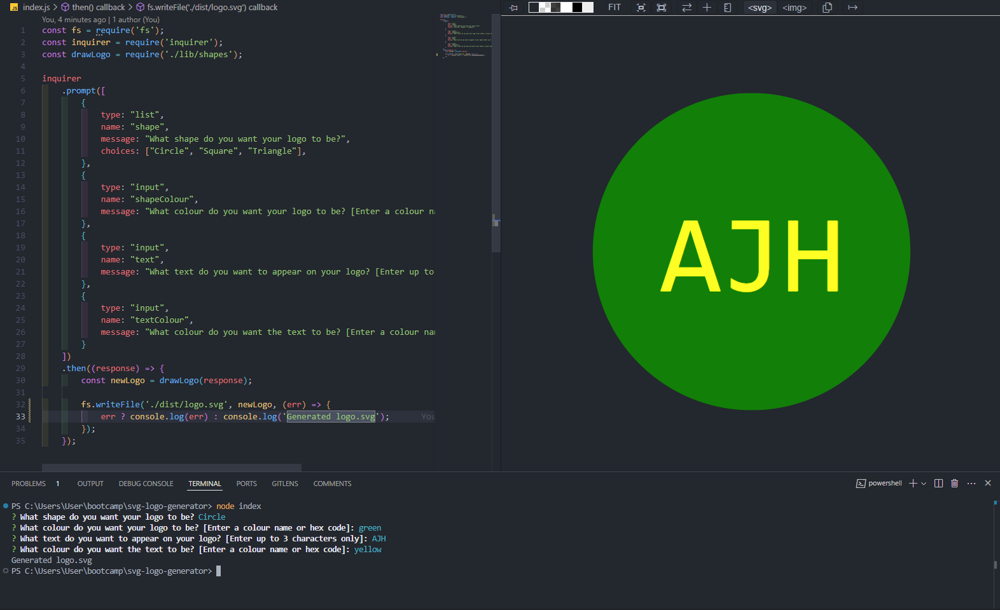

# svg-logo-generator

10-OOP/02-Challenge - SVG Logo Generator

## Description

Module 10 - Object-Oriented Programming: SVG Logo Generator using Inquirer and Jest

Development of .svg file using NodeJS and Inquirer to create a logo with a user defined shape, shaoe colour, 3-character text, and text colour, through the execution of the following:

- user input prompts for logo details
- automatic generation of SVG file based on user input

Project executed in accordance with the following challenge requirements:

### User Story

```md
AS a freelance web developer
I WANT to generate a simple logo for my projects
SO THAT I don't have to pay a graphic designer
```

### Acceptance Criteria

```md
GIVEN a command-line application that accepts user input
WHEN I am prompted for text
THEN I can enter up to three characters
WHEN I am prompted for the text color
THEN I can enter a color keyword (OR a hexadecimal number)
WHEN I am prompted for a shape
THEN I am presented with a list of shapes to choose from: circle, triangle, and square
WHEN I am prompted for the shape's color
THEN I can enter a color keyword (OR a hexadecimal number)
WHEN I have entered input for all the prompts
THEN an SVG file is created named `logo.svg`
AND the output text "Generated logo.svg" is printed in the command line
WHEN I open the `logo.svg` file in a browser
THEN I am shown a 300x200 pixel image that matches the criteria I entered
```

## Table of Contents

- [Installation](#installation)
- [Usage](#usage)
- [Credits](#credits)
- [License](#license)

## Installation

Install [NodeJS](https://nodejs.org/en) and NPM on your computer to install the required dependencies for this NodeJS application.

Git and an IDE (VSCode recommended) are required to be installed on your computer to clone and view the code for this web application.

From your command line:

```md
### Clone this repository
$ git clone git@github.com:ajhearne-mZAOSW/svg-logo-generator.git

### Navigate into the repository
$ cd svg-logo-generator

### Open in IDE
$ code .
```

In the integrated terminal, run the following commands:

```md
### Install dependencies
npm install

### Run the application
node index.js
```

The application will then prompt you for the information required to generate the README file.

To execute the text cases, run the following command in the integrated terminal:

```md
npm test
```

## Usage

The following image shows the application's appearance and functionality:



A video showing process for using the application can be found [here.](./examples/ahearne_svglogogenerator_walkthrough.webm)

## Credits

- Learning foudation provided by University of Sydney, USYD-VIRT-FSF-PT-05-2024-U-LOLC/10-OOP/01-Activities
- SVG Tutorial provided by [W3Schools](https://developer.mozilla.org/en-US/docs/Web/SVG/Tutorial)

## License

MIT